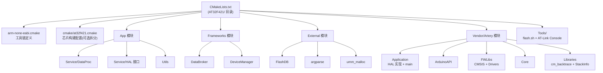
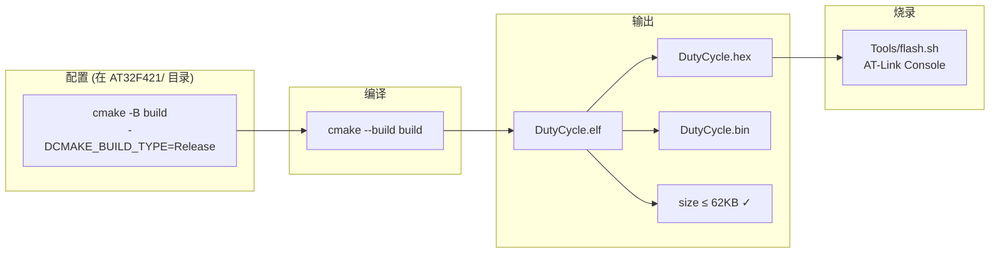
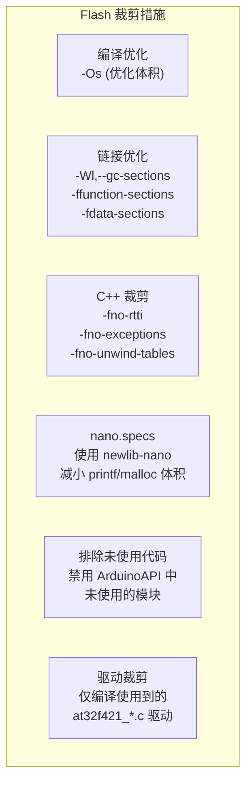
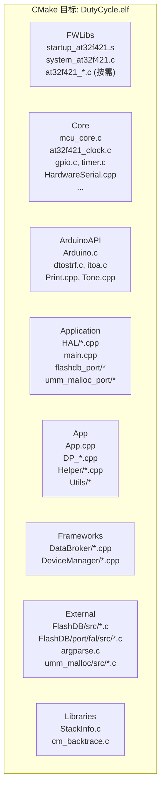
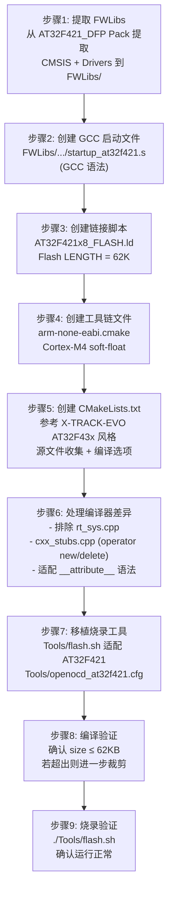
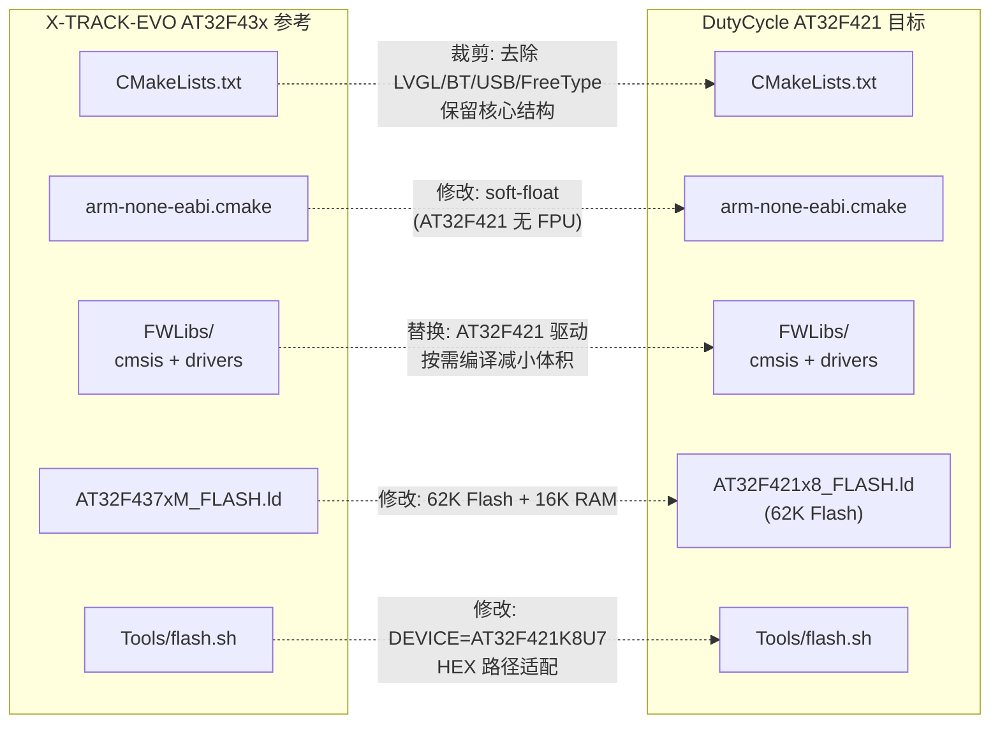

# Keil → CMake + GCC 工程移植设计方案

## 1. 项目概述

### 1.1 当前状态

| 项目 | 当前值 |
|------|--------|
| MCU | AT32F421K8U7 (ArteryTek Cortex-M4) |
| Flash | 64KB (0x08000000 - 0x08010000) |
| RAM | 16KB (0x20000000 - 0x20004000) |
| 编译器 | ARM-ADS (ARMCLANG v6.16) |
| 构建系统 | Keil MDK-ARM (.uvprojx) |
| 输出名称 | DutyCycle |
| 编译定义 | `ARDUINO=111` |

### 1.2 Flash 分区布局

```
0x08000000 ┌──────────────────────┐
           │                      │
           │   Firmware (62KB)    │
           │                      │
0x0800F800 ├──────────────────────┤
           │   KVDB (2KB)         │
0x08010000 └──────────────────────┘
```

- **固件区域**：62KB (0x08000000 - 0x0800F800)，链接脚本中 Flash LENGTH 限制为 62K
- **KVDB 区域**：2KB (0x0800F800 - 0x08010000)，由 FlashDB 管理，不可被固件覆盖

### 1.3 目标状态

| 项目 | 目标值 |
|------|--------|
| 编译器 | arm-none-eabi-gcc |
| 构建系统 | CMake 3.16+ |
| C 标准 | C11 (C99 兼容) |
| C++ 标准 | C++11 |
| 输出格式 | .elf / .hex / .bin |
| IDE 支持 | VSCode (compile_commands.json) |
| 烧录工具 | Artery AT-Link Console (Linux) |
| Flash 限制 | 固件 ≤ 62KB |

## 2. 架构设计

### 2.1 整体构建架构

参考 X-TRACK-EVO 的 AT32F43x CMake 工程结构，CMake 入口放置在 `Firmware/Vendor/Artery/Platform/AT32F421/`。



### 2.2 文件目录结构设计

```
Firmware/Vendor/Artery/Platform/AT32F421/    (CMake 工程根目录)
├── CMakeLists.txt                           # 顶层 CMake 入口
├── arm-none-eabi.cmake                      # GCC 工具链文件
├── FWLibs/                                  # 新增: AT32F421 固件库 (从 DFP Pack 提取)
│   ├── cmsis/
│   │   └── cm4/
│   │       ├── core_support/                # ARM CMSIS Core 头文件
│   │       └── device_support/              # AT32F421 设备头文件 + system 文件
│   │           └── startup/
│   │               └── gcc/
│   │                   ├── startup_at32f421.s    # GCC 格式启动文件
│   │                   └── linker/
│   │                       └── AT32F421x8_FLASH.ld  # 链接脚本 (62K Flash)
│   └── drivers/
│       ├── inc/                             # 外设驱动头文件 (at32f421_*.h)
│       └── src/                             # 外设驱动源文件 (at32f421_*.c)
├── Config/                                  # 已有: MCU 配置
│   └── mcu_config.h
├── Core/                                    # 已有: 平台核心驱动
│   └── *.c / *.cpp / *.h
├── MDK-ARM/                                 # 已有: Keil 工程 (保留)
│   └── proj.uvprojx
└── build/                                   # 构建输出 (gitignore)

Firmware/Vendor/Artery/Tools/                (烧录工具目录, 新增)
├── flash.sh                                 # 烧录脚本 (适配 AT32F421)
├── openocd_at32f421.cfg                     # OpenOCD 配置 (备选)
└── Artery_ATLINK_Console_Linux-x86_64_V3.0.17/
    ├── ATLink_Console                       # AT-Link 烧录工具
    ├── ATLink_Console.sh
    ├── download.sh
    ├── lib*.so*                             # 依赖库
    └── WriteSN.ini
```

**相对路径关系** (从 CMake 工程根 `AT32F421/` 出发)：

| 变量 | 路径 | 目标 |
|------|------|------|
| `PLATFORM_DIR` | `${CMAKE_CURRENT_SOURCE_DIR}` | AT32F421/ |
| `VENDOR_DIR` | `${PLATFORM_DIR}/../..` | Vendor/Artery/ |
| `PROJECT_ROOT` | `${VENDOR_DIR}/../..` | Firmware/ |
| `APP_DIR` | `${PROJECT_ROOT}/App` | Firmware/App/ |
| `FRAMEWORKS_DIR` | `${PROJECT_ROOT}/Frameworks` | Firmware/Frameworks/ |
| `EXTERNAL_DIR` | `${PROJECT_ROOT}/External` | Firmware/External/ |
| `FWLIBS_DIR` | `${PLATFORM_DIR}/FWLibs` | AT32F421/FWLibs/ |
| `LIBRARIES_DIR` | `${VENDOR_DIR}/Libraries` | Vendor/Artery/Libraries/ |
| `APPLICATION_DIR` | `${VENDOR_DIR}/Application` | Vendor/Artery/Application/ |
| `ARDUINO_API_DIR` | `${VENDOR_DIR}/ArduinoAPI` | Vendor/Artery/ArduinoAPI/ |
| `CORE_DIR` | `${PLATFORM_DIR}/Core` | AT32F421/Core/ |

### 2.3 构建与烧录流程



## 3. 详细设计

### 3.1 工具链文件 (`arm-none-eabi.cmake`)

参考 X-TRACK-EVO 的 `arm-none-eabi.cmake`，适配 AT32F421 (Cortex-M4 无 FPU)：

```cmake
set(CMAKE_SYSTEM_NAME Generic)
set(CMAKE_SYSTEM_PROCESSOR arm)

set(CMAKE_C_COMPILER arm-none-eabi-gcc)
set(CMAKE_CXX_COMPILER arm-none-eabi-g++)
set(CMAKE_ASM_COMPILER arm-none-eabi-gcc)
set(CMAKE_OBJCOPY arm-none-eabi-objcopy)
set(CMAKE_OBJDUMP arm-none-eabi-objdump)
set(CMAKE_SIZE arm-none-eabi-size)

set(CMAKE_FIND_ROOT_PATH_MODE_PROGRAM NEVER)
set(CMAKE_FIND_ROOT_PATH_MODE_LIBRARY ONLY)
set(CMAKE_FIND_ROOT_PATH_MODE_INCLUDE ONLY)
set(CMAKE_FIND_ROOT_PATH_MODE_PACKAGE ONLY)

set(CMAKE_TRY_COMPILE_TARGET_TYPE STATIC_LIBRARY)

# Cortex-M4 flags (AT32F421 无 FPU，使用 soft float)
set(MCU_FLAGS "-mcpu=cortex-m4 -mthumb -mfloat-abi=soft")

set(CMAKE_C_FLAGS_INIT "${MCU_FLAGS}")
set(CMAKE_CXX_FLAGS_INIT "${MCU_FLAGS}")
set(CMAKE_ASM_FLAGS_INIT "${MCU_FLAGS}")
set(CMAKE_EXE_LINKER_FLAGS_INIT
    "${MCU_FLAGS} -specs=nano.specs -specs=nosys.specs -Wl,--gc-sections")
```

### 3.2 CMakeLists.txt 结构

参考 X-TRACK-EVO 的 `CMakeLists.txt` 风格：

```cmake
cmake_minimum_required(VERSION 3.13)

set(CMAKE_EXPORT_COMPILE_COMMANDS ON)

if(NOT DEFINED CMAKE_TOOLCHAIN_FILE)
  set(CMAKE_TOOLCHAIN_FILE
      "${CMAKE_CURRENT_SOURCE_DIR}/arm-none-eabi.cmake"
      CACHE PATH "Toolchain file")
endif()

project(DutyCycle C CXX ASM)

set(CMAKE_C_STANDARD 99)
set(CMAKE_CXX_STANDARD 11)

# Directory aliases (同 X-TRACK-EVO 风格)
set(PLATFORM_DIR ${CMAKE_CURRENT_SOURCE_DIR})
set(VENDOR_DIR ${PLATFORM_DIR}/../..)
set(PROJECT_ROOT ${VENDOR_DIR}/../..)
...
```

### 3.3 链接脚本 (`FWLibs/cmsis/cm4/device_support/startup/gcc/linker/AT32F421x8_FLASH.ld`)

**关键：Flash LENGTH = 62K，为 KVDB 预留 2KB**

```ld
MEMORY
{
    FLASH (rx)  : ORIGIN = 0x08000000, LENGTH = 62K   /* 62KB 固件区 */
    RAM   (rwx) : ORIGIN = 0x20000000, LENGTH = 16K
}

_Min_Heap_Size  = 0x40;   /* 64 bytes */
_Min_Stack_Size = 0x1000; /* 4KB */
```

### 3.4 Flash 裁剪策略

64KB 总 Flash 中仅 62KB 可用于固件，需要严格控制代码体积：



| 裁剪手段 | 预估节省 | 说明 |
|----------|----------|------|
| `-Os` 替代 `-O3` | 5-15KB | 体积优先优化 |
| `-fno-rtti -fno-exceptions` | 2-5KB | 禁用 C++ RTTI 和异常 |
| `-fno-unwind-tables` | 1-2KB | 禁用栈展开表 |
| `nano.specs` | 5-10KB | 使用精简 C 库 |
| `--gc-sections` | 3-8KB | 移除未引用的函数/数据 |
| 驱动按需编译 | 2-5KB | 仅编译实际使用的外设驱动 |
| 排除未用 ArduinoAPI | 1-3KB | Stream/Wire/WString 等 |

### 3.5 源文件组织

参考 X-TRACK-EVO 的分组方式：



### 3.6 驱动按需编译

AT32F421 外设驱动不使用 `file(GLOB)`，而是显式列出实际使用的驱动，减小体积：

```cmake
# 仅编译使用到的外设驱动 (参考 Keil RTE 中启用的组件)
set(FWLIBS_DRIVER_SOURCES
    ${FWLIBS_DIR}/drivers/src/at32f421_crm.c
    ${FWLIBS_DIR}/drivers/src/at32f421_gpio.c
    ${FWLIBS_DIR}/drivers/src/at32f421_misc.c
    ${FWLIBS_DIR}/drivers/src/at32f421_tmr.c
    ${FWLIBS_DIR}/drivers/src/at32f421_usart.c
    ${FWLIBS_DIR}/drivers/src/at32f421_flash.c
    ${FWLIBS_DIR}/drivers/src/at32f421_adc.c
    ${FWLIBS_DIR}/drivers/src/at32f421_dma.c
    ${FWLIBS_DIR}/drivers/src/at32f421_exint.c
    ${FWLIBS_DIR}/drivers/src/at32f421_pwc.c
    ${FWLIBS_DIR}/drivers/src/at32f421_scfg.c
    ${FWLIBS_DIR}/drivers/src/at32f421_spi.c
    ${FWLIBS_DIR}/drivers/src/at32f421_wdt.c
    ${FWLIBS_DIR}/drivers/src/at32f421_ertc.c
    ${FWLIBS_DIR}/drivers/src/at32f421_i2c.c
    ${FWLIBS_DIR}/drivers/src/at32f421_debug.c
)
```

### 3.7 烧录工具 (`Tools/`)

从 X-TRACK-EVO 移植 `Artery/Tools/` 目录，适配 AT32F421：

**`Tools/flash.sh`** 主要修改：
- `DEVICE` 改为 `"AT32F421K8U7"`
- `DEFAULT_HEX` 路径改为 `"../Platform/AT32F421/build/DutyCycle.hex"`

**`Tools/openocd_at32f421.cfg`** 主要修改：
- `CHIPNAME` 改为 `at32f421`
- `WORKAREASIZE` 改为 `0x4000` (16KB RAM)
- Flash bank size 适配 64KB

### 3.8 构建类型配置

```cmake
# Release: 体积优先 (62KB 限制)
set(CMAKE_C_FLAGS_RELEASE   "-Os -g -DNDEBUG" CACHE STRING "" FORCE)
set(CMAKE_CXX_FLAGS_RELEASE "-Os -g -DNDEBUG" CACHE STRING "" FORCE)

# Debug: 调试优先
set(CMAKE_C_FLAGS_DEBUG   "-O0 -g3 -DDEBUG" CACHE STRING "" FORCE)
set(CMAKE_CXX_FLAGS_DEBUG "-O0 -g3 -DDEBUG" CACHE STRING "" FORCE)
```

> 注意：Release 使用 `-Os` 而非 `-O3`，因为 62KB Flash 空间紧张。`-g` 不影响 .hex/.bin 体积。

## 4. 移植步骤



## 5. 关键差异处理

### 5.1 需要排除的文件

| 文件 | 原因 |
|------|------|
| `rt_sys.cpp` | Keil 特有的 retarget 实现 |
| `Stream.cpp` | Keil 工程中已禁用 |
| `Wire.cpp` | Keil 工程中已禁用 |
| `WireBase.cpp` | Keil 工程中已禁用 |
| `WMath.cpp` | Keil 工程中已禁用 |
| `WString.cpp` | Keil 工程中已禁用 |

### 5.2 需要新增的文件

| 文件 | 位置 | 来源 |
|------|------|------|
| GCC 启动文件 | `FWLibs/cmsis/cm4/device_support/startup/gcc/` | 从 ArteryTek BSP 获取或从 Keil 版转换 |
| 链接脚本 | `FWLibs/.../linker/AT32F421x8_FLASH.ld` | 新建 (62K Flash + 16K RAM) |
| cxx_stubs.cpp | `Core/cxx_stubs.cpp` | 参考 X-TRACK-EVO，提供 `__cxa_pure_virtual` 等桩 |
| 工具链文件 | `arm-none-eabi.cmake` | 参考 X-TRACK-EVO 适配 |
| 烧录脚本 | `../../Tools/flash.sh` | 从 X-TRACK-EVO 移植并适配 |
| OpenOCD 配置 | `../../Tools/openocd_at32f421.cfg` | 从 X-TRACK-EVO 移植并适配 |

### 5.3 编译器差异适配

| 差异点 | ARMCLANG | GCC |
|--------|----------|-----|
| 对齐属性 | `__align(n)` | `__attribute__((aligned(n)))` |
| 弱符号 | `__weak` | `__attribute__((weak))` |
| 编译器标识 | `__ARMCC_VERSION` | `__GNUC__` |
| C++ 纯虚函数 | 内置支持 | 需要 `__cxa_pure_virtual` 桩 |
| operator new/delete | 内置 | 需要 cxx_stubs 或 umm_malloc 重定向 |

### 5.4 特殊编译选项

| 文件/模块 | 特殊选项 |
|-----------|----------|
| `HAL_FaultHandle.cpp` | `-fno-lto` |
| 第三方库 (FlashDB, umm_malloc, argparse) | `-w` (抑制警告) |
| 项目代码 (App, Core, HAL) | `-Wall -Wextra -Werror -Wno-unused-parameter` |

## 6. 构建命令

```bash
# 进入 CMake 工程目录
cd Firmware/Vendor/Artery/Platform/AT32F421

# 配置 (Release, 默认)
cmake -B build

# 配置 (Debug)
cmake -B build -DCMAKE_BUILD_TYPE=Debug

# 编译
cmake --build build

# 烧录
../../Tools/flash.sh

# 烧录 (带擦除和验证)
../../Tools/flash.sh -e -r -v

# 清理
cmake --build build --target clean
```

## 7. 与参考工程的对应关系



## 8. 风险与注意事项

1. **62KB Flash 限制**：这是最大风险。GCC 编译的代码通常比 ARMCLANG 略大。如果 Release (`-Os`) 编译后超出 62KB，需要进一步裁剪：
   - 移除 `cm_backtrace`（节省 ~2-3KB）
   - 精简 FlashDB（仅保留 KVDB，移除 TSDB）
   - 减小 Shell 功能
   - 考虑使用 `-flto` 链接时优化

2. **DFP Pack 提取**：需要从 ArteryTek 官方 `AT32F421_DFP.2.1.7` 包中提取 CMSIS 和驱动源码，组织为 `FWLibs/` 目录结构。

3. **启动文件**：优先从 ArteryTek 官方 BSP 获取 GCC 版本的启动文件，避免手动转换出错。

4. **C++ ABI**：确保 `cxx_stubs.cpp` 提供所有必要的 C++ 运行时桩函数（`__cxa_pure_virtual`, `__cxa_atexit`, operator new/delete 等）。

5. **KVDB 分区对齐**：链接脚本中 Flash 长度必须严格为 62K，确保固件不会覆盖 KVDB 数据区。`fal_cfg.h` 中已定义分区偏移为 `(64-2)*1024`。

6. **烧录工具依赖**：AT-Link Console 工具依赖 Qt5 和 ICU 库，仅支持 Linux x86_64。如需跨平台烧录，可使用 OpenOCD 作为备选方案。

7. **ArduinoAPI 部分禁用**：多个 ArduinoAPI 文件在 Keil 中被禁用编译，CMake 中需要同样排除以节省 Flash。
