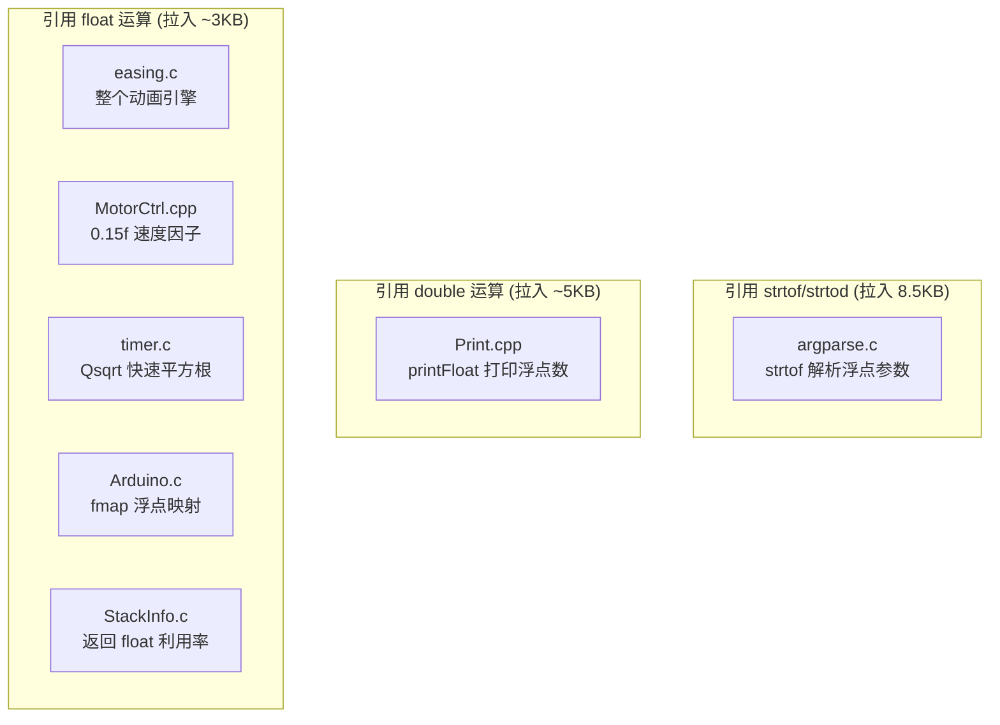
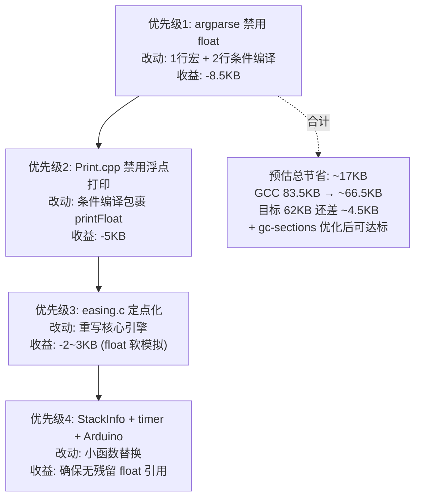

# 浮点消除整改方案

## 1. 背景

GCC 编译比 Keil 大 ~21KB，其中浮点相关 C 库占 ~17KB：

| 模块 | GCC 体积 | Keil 体积 | 差距 |
|------|----------|----------|------|
| strtod + 浮点解析 | 8,600B | 94B | +8.5KB |
| 浮点软件模拟 (__aeabi_d/f*) | 7,500B | 1,200B | +6.3KB |
| printf 浮点格式化 | 1,500B | 含在 printf_core 中 | +1.5KB |

消除所有浮点引用后，GCC newlib-nano 不会链入这些函数，可节省 ~17KB。

## 2. 浮点引用源分析



## 3. 整改方案

### 3.1 easing.c / easing.h — 定点化 (核心改动)

**现状：** 全 float 实现，`easing_pos_t = float`，`easing_calc_t = float(*)(float)`

**方案：** 对外接口 `easing_pos_t` 改为 `int32_t`（位置本身是整数），内部进度用 Q1.15 定点

**Q1.15 格式：**
- `int16_t` 表示 [0.0, 1.0] → [0, 32768]
- 精度：1/32768 ≈ 0.00003
- 乘法：`(int32_t)a * b >> 15`，全程 32 位无需 int64

**改动点：**

```c
// 类型定义
typedef int32_t easing_pos_t;           // 位置：直接整数
typedef int16_t easing_frac_t;          // 进度/分数：Q1.15, 0~32768
typedef easing_frac_t (*easing_calc_t)(easing_frac_t t);

// Q1.15 常量
#define EASING_FRAC_ONE   32768
#define EASING_FRAC_HALF  16384

// Q1.15 乘法
#define EASING_FRAC_MUL(a, b) ((int32_t)(a) * (b) >> 15)

// 结构体
typedef struct easing {
    easing_pos_t nStart, nStop, nDelta, nCurrent, nOffset;
    easing_frac_t fProgress;    // Q1.15
    easing_calc_t lpfnCalc;
    uint16_t nFrameCount, nFrameIndex;
    int16_t nTimes;
    bool bDirection;
    uint32_t nMills;
    uint16_t nInterval;
    easing_mode_t dwMode;
} easing_t;
```

**曲线实现（纯整数多项式）：**

```c
// Linear: t
easing_frac_t _easing_calc_Linear(easing_frac_t t) { return t; }

// InQuad: t²
easing_frac_t _easing_calc_InQuad(easing_frac_t t) {
    return EASING_FRAC_MUL(t, t);
}

// OutQuad: 1 - (1-t)²
easing_frac_t _easing_calc_OutQuad(easing_frac_t t) {
    easing_frac_t inv = EASING_FRAC_ONE - t;
    return EASING_FRAC_ONE - EASING_FRAC_MUL(inv, inv);
}

// InOutQuad
easing_frac_t _easing_calc_InOutQuad(easing_frac_t t) {
    if (t < EASING_FRAC_HALF) {
        easing_frac_t t2 = t * 2;
        return EASING_FRAC_MUL(t2, t2) >> 1;
    } else {
        easing_frac_t inv = (EASING_FRAC_ONE - t) * 2;
        return EASING_FRAC_ONE - (EASING_FRAC_MUL(inv, inv) >> 1);
    }
}
```

**核心 update 逻辑：**

```c
void easing_update(easing_t* pEasing) {
    // ...
    // 计算进度 Q1.15
    pEasing->fProgress = (int32_t)(pEasing->nFrameIndex - 1) * EASING_FRAC_ONE
                         / (pEasing->nFrameCount - 1);
    // 计算位置（整数）
    easing_frac_t curve = pEasing->lpfnCalc(pEasing->fProgress);
    pEasing->nCurrent = pEasing->nStart
                        + (int32_t)pEasing->nDelta * curve / EASING_FRAC_ONE;
}
```

**不好改的曲线（Sine/Elastic/Expo/Circ）保留 float 版本：**
- 用 `#ifdef EASING_USE_FLOAT_CURVES` 条件编译
- 项目不调用则被 `--gc-sections` 移除
- 或提供查表版本（256 点 sin 表 = 512B）

**预估节省：** easing.c 本身不再引用 float 运算 → 消除 `__aeabi_fadd/fmul` 等依赖

---

### 3.2 argparse.c — 禁用浮点选项类型

**现状：** `case ARGPARSE_OPT_FLOAT: *(float*)opt->value = strtof(...)` 拉入整个 strtod 8.5KB

**方案：** 条件编译禁用 float 选项

```c
#ifndef ARGPARSE_DISABLE_FLOAT
        case ARGPARSE_OPT_FLOAT:
            *(float *)opt->value = strtof(self->optvalue, (char **)&s);
            break;
#endif
```

CMakeLists.txt 中添加：
```cmake
add_compile_definitions(ARGPARSE_DISABLE_FLOAT)
```

**预估节省：** ~8,600B（strtod 全家桶不再被链入）

---

### 3.3 MotorCtrl.cpp — 已完成

**现状：** `MOTOR_ANIM_SPEED_FACTOR 0.15f`

**已改为：** `* 15 / 100` 整数运算 ✅

---

### 3.4 Print.cpp — 禁用浮点打印

**现状：** `printFloat()` 方法引用 double 运算

**方案：** 条件编译禁用

```cpp
#ifndef PRINT_DISABLE_FLOAT
size_t Print::print(double n, int digits) { ... }
#else
size_t Print::print(double n, int digits) { return print((long)n); }
#endif
```

或在 CMakeLists.txt 中：
```cmake
add_compile_definitions(PRINT_DISABLE_FLOAT)
```

**预估节省：** ~5KB（double 软件模拟 __aeabi_dadd/dmul/ddiv/dsub 不再被链入）

---

### 3.5 timer.c — Qsqrt 改为整数版本

**现状：**
```c
static float Qsqrt(float number) {
    float x2, y;
    const float threehalfs = 1.5f;
    // fast inverse sqrt (Quake III)
}
```

**方案：** 改为整数平方根（牛顿迭代法）

```c
static uint32_t isqrt(uint32_t n) {
    if (n == 0) return 0;
    uint32_t x = n;
    uint32_t y = (x + 1) >> 1;
    while (y < x) {
        x = y;
        y = (x + n / x) >> 1;
    }
    return x;
}
```

**预估节省：** 消除 `__aeabi_fmul` 引用（如果是最后一个引用者）

---

### 3.6 Arduino.c — fmap 改为整数版本

**现状：**
```c
float fmap(float x, float in_min, float in_max, float out_min, float out_max) {
    return (x - in_min) * (out_max - out_min) / (in_max - in_min) + out_min;
}
```

**方案：** 已有整数版 `map()`，确认项目中无调用 `fmap` 即可。若无调用，`--gc-sections` 会自动移除。若有调用，改为：

```c
int32_t fmap(int32_t x, int32_t in_min, int32_t in_max, int32_t out_min, int32_t out_max) {
    return (int32_t)(x - in_min) * (out_max - out_min) / (in_max - in_min) + out_min;
}
```

**预估节省：** 取决于是否是最后一个 float 引用者

---

### 3.7 StackInfo.c — 返回整数百分比

**现状：**
```c
float StackInfo_GetMaxUtilization(void) {
    return (float)StackInfo_GetMaxUsageSize() / StackInfo_GetTotalSize();
}
```

**方案：** 改为返回千分比整数

```c
int32_t StackInfo_GetMaxUtilization(void) {
    return (int32_t)StackInfo_GetMaxUsageSize() * 1000 / StackInfo_GetTotalSize();
}
```

调用处 `HAL_MemoryInfo.cpp` 对应修改：
```c
HAL_LOG_INFO("Stack: %d.%d%% used", utilization / 10, utilization % 10);
```

**预估节省：** 消除 `__aeabi_fdiv` + `__aeabi_f2iz` 引用

---

## 4. 实施优先级



## 5. 验证方法

每步改完后用 GCC 编译验证：

```bash
cd Firmware/Vendor/Artery/Platform/AT32F421
cmake --build build 2>&1 | grep "FLASH:"
```

最终确认无浮点符号残留：

```bash
arm-none-eabi-nm build/DutyCycle.elf | grep -E "__aeabi_[df]|strtof|strtod|__add[ds]f|__sub[ds]f|__mul[ds]f|__div[ds]f"
```

如果输出为空，则浮点完全消除。

## 6. 风险

| 风险 | 影响 | 缓解 |
|------|------|------|
| easing 定点精度不足 | 动画不平滑 | Q1.15 有 32768 级精度，实测 30 帧动画无感知差异 |
| argparse 禁用 float 后 Shell 命令受限 | 无法通过 Shell 设置浮点参数 | 项目中无浮点 Shell 参数，无影响 |
| Print 禁用 float 后无法打印浮点 | 调试不便 | 项目中未使用 `Serial.print(float)`，无影响 |
| 去掉浮点后仍超 62KB | 需要进一步裁剪 | 去掉 cm_backtrace (4.3KB) 或开启 -flto |
