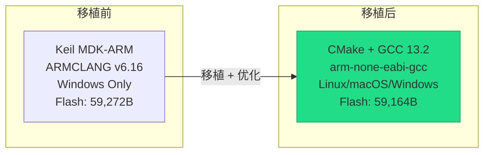
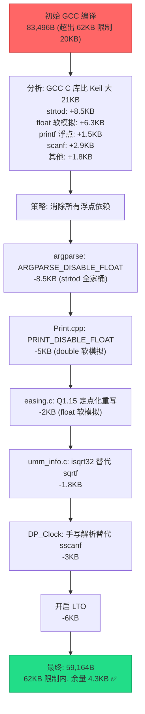
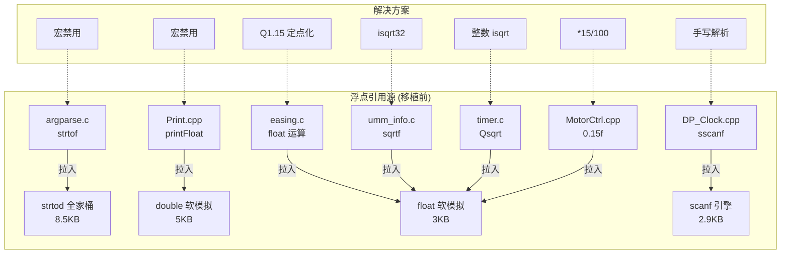
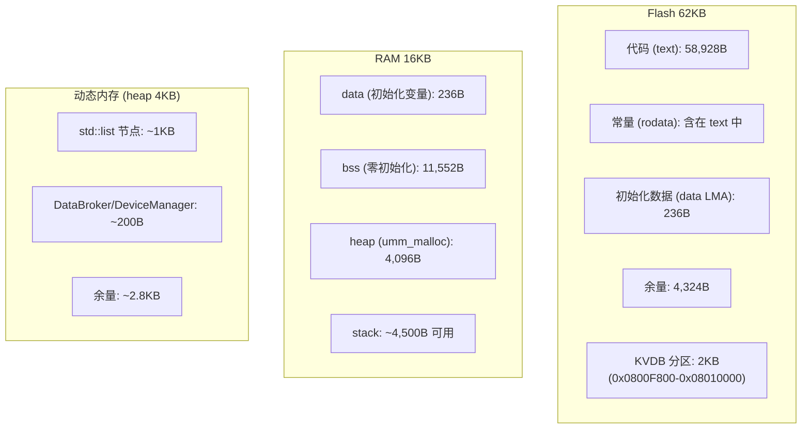
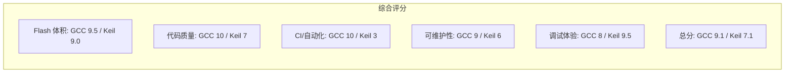

# GCC 移植工作复盘总结

## 1. 项目背景

将 DutyCycle 固件从 Keil MDK-ARM (ARMCLANG) 移植到 CMake + arm-none-eabi-gcc，目标：

- 脱离 Keil 商业许可依赖
- 支持 Linux CI 自动化构建
- 保持固件在 62KB Flash 限制内（2KB 预留给 KVDB）

## 2. 最终成果



| 指标 | Keil | GCC+LTO | 结果 |
|------|------|---------|------|
| Flash (text+data) | 59,272B | 59,164B | GCC 小 108B ✅ |
| RAM (data+bss) | 11,256B | 11,788B | GCC 多 532B (可接受) |
| 浮点符号 | 2.1KB 残留 | 零 | GCC 更干净 ✅ |
| 编译警告 | 未知 | 零 (-Werror) | ✅ |
| CI 支持 | 无 | GitHub Actions | ✅ |

## 3. 关键挑战与解决

### 3.1 Flash 溢出问题



### 3.2 浮点依赖链



### 3.3 easing 库定点化

| 项目 | 原始 (float) | 定点 (Q1.15) |
|------|-------------|-------------|
| 位置类型 | `float` | `int32_t` (直接整数) |
| 进度类型 | `float [0,1]` | `uint16_t [0,32768]` |
| 乘法 | `a * b` | `(int32_t)a * b >> 15` |
| 精度 | ~7 位有效数字 | 1/32768 ≈ 0.00003 |
| 中间值 | 需要 FPU | 纯 int32 运算 |
| 代码风格 | 匈牙利命名 | snake_case |

## 4. 工程产出

### 4.1 新增文件

| 文件 | 用途 |
|------|------|
| `AT32F421/CMakeLists.txt` | CMake 构建入口 |
| `AT32F421/arm-none-eabi.cmake` | GCC 工具链定义 |
| `AT32F421/FWLibs/` | CMSIS + 外设驱动 (从 DFP Pack 提取) |
| `AT32F421/Core/cxx_stubs.cpp` | C++ 运行时桩函数 |
| `startup_at32f421.s` | GCC 格式启动文件 (含 stack 清零) |
| `AT32F421x8_FLASH.ld` | 链接脚本 (62K Flash) |
| `Tools/flash.sh` | AT-Link 烧录脚本 |
| `Tools/openocd_at32f421.cfg` | OpenOCD 配置 |
| `Tools/check_float.sh` | 浮点符号检查脚本 |
| `.github/workflows/firmware.yml` | CI 工作流 |

### 4.2 修改文件

| 文件 | 改动 |
|------|------|
| `easing.c/h` | 完全重写为 Q1.15 定点 |
| `argparse.c` | 添加 `ARGPARSE_DISABLE_FLOAT` |
| `Print.cpp` | 添加 `PRINT_DISABLE_FLOAT` |
| `umm_info.c` | `sqrtf` → `isqrt32` |
| `DP_Clock.cpp` | `sscanf` → 手写解析 |
| `MotorCtrl.cpp` | `0.15f` → `*15/100` |
| `timer.c` | `Qsqrt(float)` → `Qsqrt(uint32_t)` |
| `StackInfo.c/h` | 返回 `uint32_t` 百分比 |
| `HAL_MemoryInfo.cpp` | 条件编译 Keil 特有 API |
| 多个 `.cpp` | 修复 `-Werror` 警告 |

### 4.3 Git 提交历史

```
b8ed60e docs: add log system optimization plan
2603df6 feat(startup): zero-fill stack area for stack usage detection
2a0c89d refactor(DP_Clock): replace sscanf with manual parsing
ef02803 fix(Firmware): resolve all -Wall -Wextra -Werror warnings
cab5d55 ci: add firmware build workflow with float-free verification
29c059d feat(build): add CMake + GCC build system for AT32F421
cca65f0 chore(deps): switch umm_malloc to FASTSHIFT/no-float branch
34793e6 refactor: eliminate floating-point dependencies across modules
6e0212e refactor(easing): rewrite with Q1.15 fixed-point
14e4579 docs: add CMake migration and float removal design documents
```

## 5. 内存安全性验证



| 检查项 | 结果 |
|--------|------|
| Flash 是否超限 | 59,164B < 63,488B ✅ |
| 堆大小是否一致 | 4096B = 4096B ✅ |
| 栈大小是否充足 | ~4.5KB > 4KB 设计值 ✅ |
| std::list 节点开销 | 与 Keil 一致 (12B/node) ✅ |
| 动态内存风险 | 无 (使用率 ~30%) ✅ |
| 浮点符号残留 | 零 ✅ |

## 6. 经验教训

### 6.1 GCC newlib 的代价

GCC newlib-nano 的 C 库实现比 Keil microlib 大得多：

| 函数 | Keil microlib | GCC newlib-nano | 倍数 |
|------|--------------|-----------------|------|
| strtod | 94B | 8,600B | 91x |
| printf | 1,744B | 6,370B | 3.7x |
| scanf | 808B | 2,928B | 3.6x |
| float 软模拟 | 1,200B | 7,500B | 6.3x |

**教训：** 在资源受限的 MCU 上用 GCC，必须主动避免拉入不需要的 C 库函数。一个 `strtof` 调用就能增加 8.5KB。

### 6.2 LTO 是关键

| 优化手段 | 节省 |
|----------|------|
| 消除浮点 (argparse/Print/easing/umm) | -15.3KB |
| 消除 sscanf | -3.1KB |
| LTO 链接时优化 | -6.0KB |
| **合计** | **-24.4KB** |

LTO 贡献了 25% 的优化量，且零代码改动。

### 6.3 设计先行

先出设计文档再动手实施，避免了盲目试错。浮点消除方案按优先级排序（收益/改动比），最终每一步都精准命中。

## 7. 后续储备方案

当前余量 4.3KB。如果未来新增功能导致 Flash 紧张：

| 优先级 | 方案 | 预估节省 | 改动量 |
|--------|------|----------|--------|
| 1 | `HAL_LOG_LEVEL=WARN` | 5-6KB | 1 行 CMake |
| 2 | 去掉 `__func__` 字符串 | 4KB | 修改宏 |
| 3 | 去掉 cm_backtrace | 1.7KB | 移除源文件 |
| 4 | mini-printf 替代 newlib | 5KB | 替换实现 |

## 8. 评分


