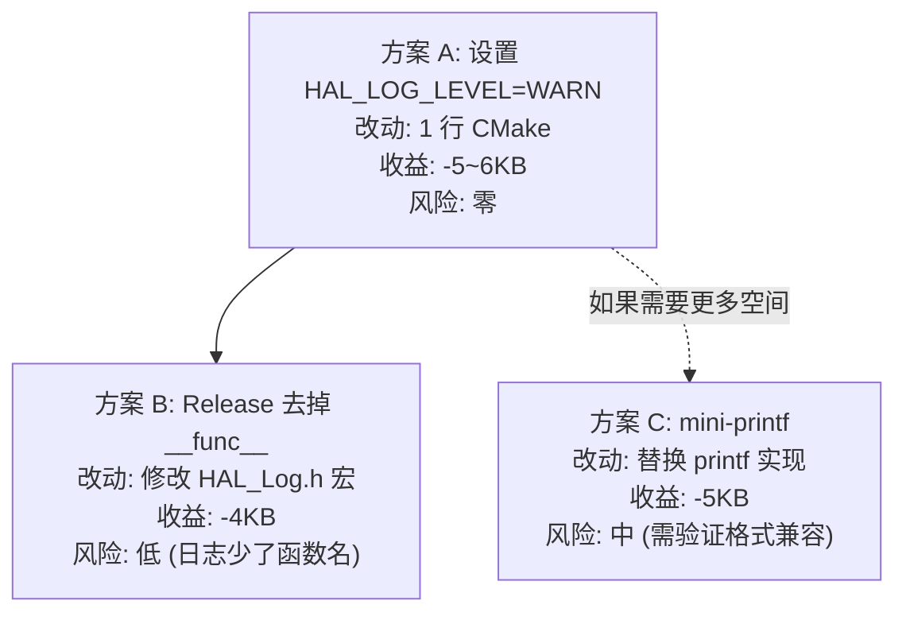

# 日志系统优化方案

## 1. 现状分析

| 组成 | 大小 | 占比 (59KB) |
|------|------|-------------|
| printf 引擎 | 6.4KB | 10.8% |
| 日志格式化字符串 | ~6KB | 10.2% |
| `__func__` 函数名字符串 | ~4KB (201个) | 6.8% |
| HAL_Log 函数本身 | 150B | 0.3% |
| **合计** | **~16.5KB** | **28%** |

日志调用统计：
- `HAL_LOG_INFO`: 62 处
- `HAL_LOG_ERROR`: 41 处
- `HAL_LOG_WARN`: 11 处
- `HAL_LOG_TRACE`: 6 处
- **总计 120 处**

## 2. 已有机制

`HAL_Log.h` 已支持编译期日志级别裁剪：

```c
#ifndef HAL_LOG_LEVEL
#define HAL_LOG_LEVEL HAL_LOG_LEVEL_TRACE  // 默认全开
#endif

#if HAL_LOG_LEVEL <= HAL_LOG_LEVEL_INFO
#define HAL_LOG_INFO(...) HAL_Log(HAL_LOG_LEVEL_INFO, __func__, __VA_ARGS__)
#else
#define HAL_LOG_INFO(...)  // 编译为空，字符串不进 binary
#endif
```

## 3. 优化方案

### 方案 A：编译期日志级别 (推荐，零改动风险)

在 CMakeLists.txt 中设置 Release 日志级别：

```cmake
# Release: 只保留 WARN + ERROR
if(CMAKE_BUILD_TYPE STREQUAL "Release")
  add_compile_definitions(HAL_LOG_LEVEL=HAL_LOG_LEVEL_WARN)
endif()
```

| 级别 | 裁掉的调用 | 预估节省 |
|------|-----------|----------|
| WARN (去掉 TRACE+INFO) | 68 处 | ~5-6KB (字符串 + __func__) |
| ERROR (去掉 TRACE+INFO+WARN) | 79 处 | ~7-8KB |
| OFF (全部去掉) | 120 处 | ~10KB + printf 引擎 6.4KB |

> 注意：Shell 的 `shell_printf` 也用 printf，所以即使日志全关，printf 引擎仍会被链入。

### 方案 B：去掉 `__func__` (中等收益，低风险)

`__func__` 每个调用点生成一个字符串常量（平均 ~20 字节），201 个约 4KB。

改为只在 Debug 模式包含函数名：

```c
#ifdef DEBUG
#define HAL_LOG_INFO(...) HAL_Log(HAL_LOG_LEVEL_INFO, __func__, __VA_ARGS__)
#else
#define HAL_LOG_INFO(...) HAL_Log(HAL_LOG_LEVEL_INFO, "", __VA_ARGS__)
#endif
```

预估节省：~4KB（所有 `__func__` 字符串被合并为一个空字符串）

### 方案 C：精简 printf → mini-printf (高收益，需验证)

用 ~1KB 的 mini-printf 替代 newlib 的 6.4KB printf：
- 只支持 `%d %u %x %s %c %p`（项目不用 `%f`）
- 不支持宽度/精度修饰符（或只支持简单的）

预估节省：~5KB

风险：需要验证所有 printf 格式化字符串兼容性。

### 方案 D：组合方案 (A + B)

```cmake
if(CMAKE_BUILD_TYPE STREQUAL "Release")
  add_compile_definitions(
    HAL_LOG_LEVEL=HAL_LOG_LEVEL_WARN
    HAL_LOG_NO_FUNC_NAME)
endif()
```

预估节省：~7-8KB，Flash 从 59KB 降到 ~51KB。

## 4. 推荐实施



当前余量 4.3KB 已足够，这些方案作为储备。如果未来新增功能导致 Flash 紧张，优先用方案 A（一行配置即可）。
